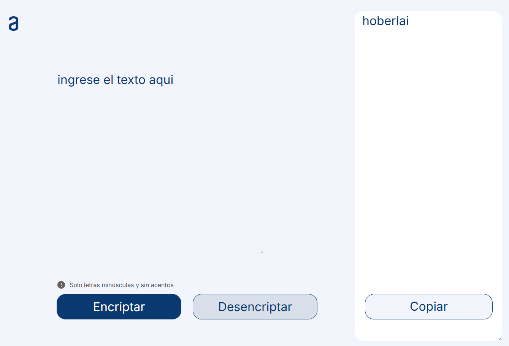
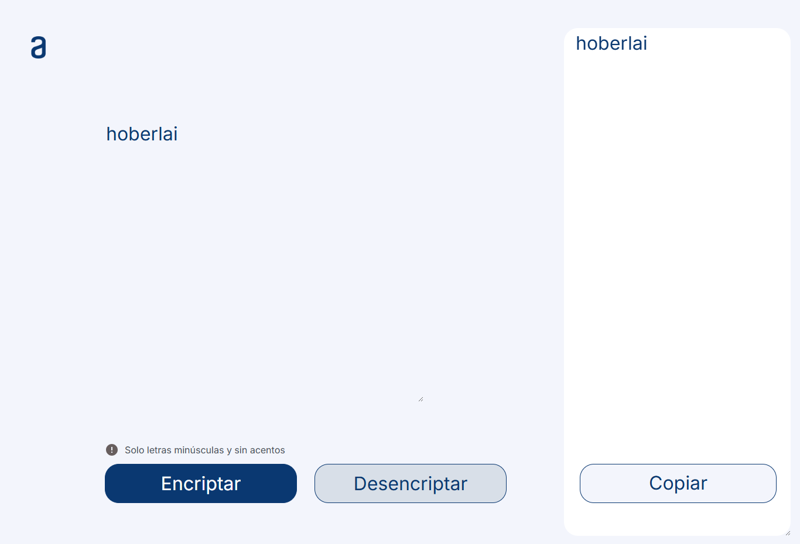

# Encriptador de Texto

Aplicación web simple desarrollada con **HTML, CSS y JavaScript** que permite **encriptar y desencriptar mensajes** usando reemplazos personalizados de vocales. La interfaz está en español, solicita ingresar solo **letras minúsculas y sin acentos**, y ofrece botones para encriptar, desencriptar y mostrar el resultado en un segundo campo de texto.

## Características

- Encriptación de texto mediante reglas de reemplazo.
- Desencriptación del mensaje encriptado.
- Interfaz limpia y fácil de usar.
- Diseño responsive básico para pantallas menores a 900 px.
- Botón **Copiar** visible después de encriptar.

## Reglas de encriptación

El proyecto utiliza la siguiente matriz de reemplazo:

- `e` → `enter`
- `i` → `imes`
- `a` → `ai`
- `o` → `ober`
- `u` → `ufat`

### Ejemplo

```text
Texto original: hola mundo

Texto Encriptado: hoberlai mufatndober
```
---
## Estructura del Proyecto
```
.
├── index.html
├── styles.css
├── script.js
├── icono.svg
└── imagenes/
    ├── Logo.png
    ├── Frame 5.png
    └── Muneco.png
 ```

## Ejecutar el Proyecto

- Descarga o clona el repositorio:
 ```text
 git clone https://github.com/scarrascoore/Encriptador2024.git
 ```
- Verifica que todos los archivos estén en la misma estructura de carpetas.
- Abre el archivo **index.html** en tu navegador.

También puedes usar una extensión como Live Server en VS Code para visualizarlo más cómodamente.

### **Cómo usarlo**

**1. Escribe un texto en el campo principal.**


**2. Haz clic en Encriptar para transformar el mensaje.**


**3. Usa el botón Copiar para colocar el resultado nuevamente en el campo de entrada. Y por último haz clic en Desencriptar para revertir el texto.**


> [!NOTE]
> En la implementación actual, el botón Copiar no copia al portapapeles; solo pasa el contenido del área de resultado al campo de texto principal.
---

### Lógica principal

La lógica está implementada en script.js mediante tres funciones principales:

```bash
encriptar() → reemplaza vocales por cadenas definidas.<br>
desencriptar() → revierte esos reemplazos.<br>
copiarMensaje() → mueve el contenido del resultado al campo de entrada.<br>
```

## Autor

**SHELVY CARRASCO ORÉ**
- GitHub: [@scarrascoore](https://github.com/scarrascoore)
- LinkedIn: [Shelvycarrascoore](https://linkedin.com/in/shelvycarrascoore)

